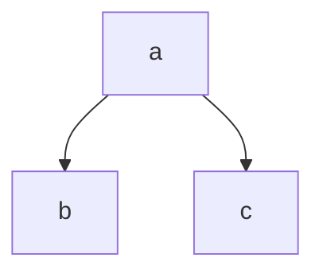

## Introduction

*Helminth* means worm. Intestinal parasites consists of 3 types of helminths:

- Nematodes (round worms)
- Cestodes (tapeworms)
- Trematodes (Flukes)

```mermaid
graph TD;
    a-->b;
    a-->c;
```